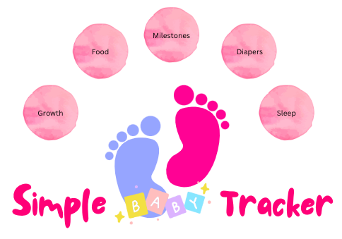

# Simple Baby Tracker

Simple Baby Tracker is an interactive command-line baby tracking application implemented in Python and deployed via Code Institute's Heroku Terminal.

The app is designed for new parents to easily log and monitor their baby's daily activities (Sleep, Feed, Diaper Changes), growth progress (weight and height) and development milestones, with a structured interface and personalized feedback, using Google Sheets backend.

## Objective
The objective of the application is to help new parents who want a simple, non-app-based solution to track their baby's daily needs and development progress using just their computer and Google account.

## User Stories

### Site Owner Goal

The primary goal of the site owner is to empower new parents by offering a reliable, user-friendly tool to track their baby’s daily habits and developmental progress. This baby tracker app serves as a digital companion during the early, often overwhelming stages of parenthood. As a parent of a newborn, I found it challenging to keep track of my baby’s daily needs and milestones while adjusting to a new routine. To solve this problem, I created a tool that not only helps other new parents, but also supports me in monitoring and understanding my baby's growth.

- **Easy Access to Data**: All logs are saved automatically and securely, giving parents access to their data anytime, anywhere.

- **Better Awareness**: I want to help parents recognize patterns in sleep, feeding, diaper changes, and growth.

- **Milestone Monitoring**: I want to enable users to track important firsts and developmental achievements.

- **Personal Insights**: I provide summaries to help users make informed decisions and spot irregularities.

- **Daily Consistency**: I want to encourage regular input to create a detailed, long-term record of their baby’s needs and progress.

- **Reduced Mental Load**: I want to support parents during a busy and emotional phase of life by simplifying the tracking process.

### First Time Visitor Goals

As a first-time user, I want to:

* Easily navigate the application and understand its purpose.
* Enter my personal details related to recovery.
* Have a record of my details that provides feedback on my progress.

### Returning Visitor Goals

As a returning user, I want to:

* Log in securely with my username.
* Enter my password to protect my information.
* Review my previously entered details and progress.

### Site Owner Goals
As the creator of Rehab Metrics, my goal is to develop an intuitive and accessible post operation tracking tool for individuals recovering from knee surgery. I aim to:

* Create a user-friendly interface that avoids medical jargon.
* Ask clear, structured questions that users can easily understand and respond to.
* Convert the user's input into meaningful feedback to give guidance on their stage of recovery.
* Store data securely using Google Sheets.
* Allow returning users to retrieve their previous entries by logging in with a username and password.
* The focus is to provide reassurance and progress tracking during a crucial recovery period.

