# Simple Baby Tracker

Simple Baby Tracker is an interactive command-line baby tracking application implemented in Python and deployed via Code Institute's Heroku Terminal.
The app is designed for new parents to easily log and monitor their baby's daily activities—such as sleep, feeding, and diaper changes—as well as track growth progress (weight and height) and developmental milestones. While every parent receives recommendations from doctors about average sleep and feeding amounts per day, this app is intended solely to help parents conveniently track their baby's data. All data is securely stored using Google Sheets integration.

## Objective
The objective of the application is to help new parents who want a simple, non-app-based solution to track their baby's daily needs and development progress using just their computer and Google account.

## User Stories

### Site Owner Goal

The primary goal of the site owner is to empower new parents by offering a reliable, user-friendly tool to track their baby’s daily habits and developmental progress. This baby tracker app serves as a digital companion during the early, often overwhelming stages of parenthood. As a parent of a newborn, I found it challenging to keep track of my baby’s daily needs and milestones while adjusting to a new routine. To solve this problem, I created a tool that not only helps other new parents, but also supports me in monitoring and understanding my baby's growth.

- **Easy Access to Data**: I want all logs to be saved automatically, giving parents access to their data anytime, anywhere.

- **Better Awareness**: I want to help parents recognize patterns in sleep, feeding, diaper changes, and growth.

- **Milestone Monitoring**: I want to enable users to track important firsts and developmental achievements.

- **Personal Insights**: I provide summaries to help users make informed decisions and spot irregularities.

- **Daily Consistency**: I want to encourage regular input to create a detailed, long-term record of their baby’s needs and progress.

- **Reduced Mental Load**: I want to support parents during a busy and emotional phase of life by simplifying the tracking process.

- **Returning Users Login System**: I want enable returning users to access their past logs through a simple username login system.

- **Application Structure**: I want straightforward, well-structured questions that are easy for users to understand and answer.

### Site User Goals

#### First-time users

- **Understand the App’s Purpose**: I want to quickly grasp that the app helps parents track their baby's daily needs and development.

- **See the Benefits**: I want to learn how the app reduces stress by organizing data and offering helpful summaries and feedback.

- **Know It’s Beginner-Friendly**: I want to feel reassured that no advanced technical skills are needed to use the app.

#### Returning users

- I want to feel supported by having one simple, organized place to manage my baby’s routine.
- I want to view summaries of sleep, feeding, and diaper data to spot patterns and track consistency.
- I want to update milestones as my baby reaches new developments.
- I want to log daily baby activities quickly by just using my username.

## Flowchart

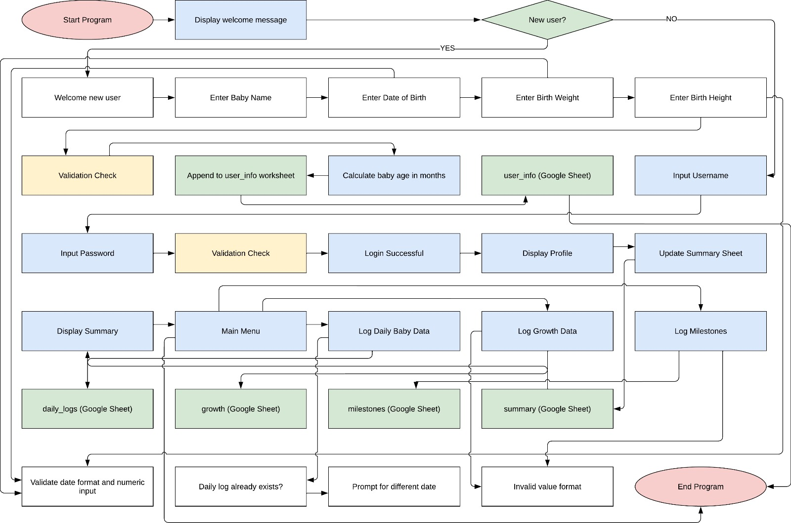

## Features

### User Registration

1. **Main welcome message**

The main welcome message is the friendly introductory text displayed before the program asks the user whether they are a new user or not. It helps set a positive tone and guides them on what to expect.

2. **User Login System**

When the program starts, it displays a prompt asking the user if they are a new user or a returning user. This helps guide users through the appropriate next steps.

This user-friendly menu ensures that both new and returning users can easily access the application and manage their profiles or data accordingly.

3. **New User Welcome Message**

When a new user starts the app, a clear and friendly welcome message guides them through the registration process.
It explains what information they need (e.g., baby’s birth date and stats), provides instructions on how to quit or go back during input, and sets expectations for what happens after registration (logging in, viewing profile, adding data).
This feature ensures users feel supported and informed right from the start, improving onboarding and reducing confusion.

4. **User Registration**

It checks if the chosen username already exists to avoid duplicates.
It collects baby name, date of birth (validated to ensure proper date format), birth weight, and height.
It automatically computes baby age in months from date of birth.
It saves all this info in the user_info worksheet.
It ensures all fields are entered correctly before saving, prompting users to correct mistakes.
Users can quit or go back at any point during data entry, except at the very first prompt (the username input), where going back is not applicable since it is the start of the interaction.
After completing the registration process, users receive an explicit success message (✅ Registration successful!) confirming their profile has been created.
This feedback reassures users that their information was saved correctly and they can proceed confidently to log in or add more data.

This ensures accurate baseline data for each baby.

5. **Personalized Welcome After Registration** 

After successful registration, the app greets the user by name (e.g., "Hello, (username)! 🎉"), creating a warm and welcoming experience. Once basic baby details are entered, the app seamlessly guides the user to begin daily logging—making the transition into the main tracking features intuitive and friendly.

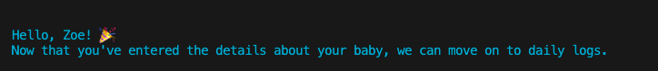

6. **Daily Baby Data Logging, Growth Data Logging and Milestone Logging**

Users input daily:
- Date (validated)
- Sleep duration (hours, numeric)
- Feeding amount (ml, numeric)
- Wet diapers count (numeric)
- Dirty diapers count (numeric)

Growth Data Captured:
- Date of measurement
- Baby’s weight (kg)
- Baby’s height (cm)

- Milestone Date achieved
- Description of milestone (e.g., “First smile”, “Crawling”)

I want the user to be able to type 'q' to quit everywhere and 'b' to go back everywhere except the very first prompt of the log data entry (e.g., the date input in log_daily_baby_data, log_growth_data, log_milestones),since it is the start of the interaction. 
The Log Baby Milestone feature consists of just one prompt for the date and one for the description, making it simple and efficient. Since it's a short flow, there is no option to go back ('b'); users can still quit at any time using 'q'.
**Describe the milestone (e.g., “babbling”) (or type 'q' to quit):** - offers more clarity by giving complete and relatable examples of baby milestones, helping users understand what kind of input is expected.
The app automatically checks if a log already exists for the selected date to avoid duplicate entries
Upon successful submission, the app provides a clear visual confirmation messages.

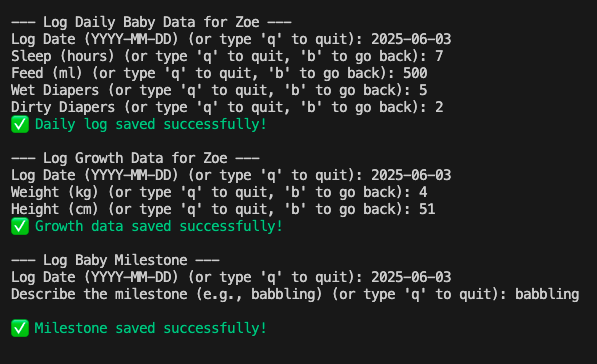

7. **Goodbye Message**

After successfully logging daily baby data, growth metrics, and milestones, the app provides a clear and warm farewell message.
This message confirms that:
- All relevant data has been recorded and saved.
- The session is ending gracefully.
- Users feel a sense of completion and reassurance that their entries were successful.

It adds a personal touch and improves user experience by clearly signaling the end of the logging process.

8. **Validation**

For feed, sleep, height, weight, and diapers, a visitor should enter numeric values and to make sure to use the correct date format.

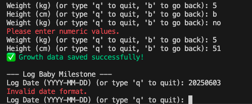

For the main menu, the user can only enter numbers from 1 to 4; no other input is allowed.

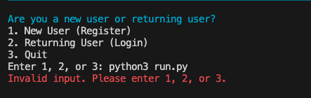

I wanted it to have a touch of a real app, so the username must be unique — if a user tries to enter one that already exists, an error message is shown.

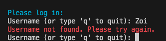

The app checks for existing entries when logging daily data, growth, or milestones.
This prevents duplicate entries and maintains data accuracy.
Users can then enter a new date or quit the logging process.

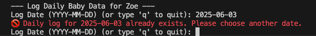

Users can log developmental milestones for their baby, such as "first smile", "rolling over", or "babbling".
The system does not accept numeric-only milestone entries to ensure meaningful descriptions. Users are prompted to use words when describing milestones.

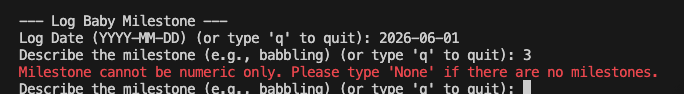

9. **Back and Quit**

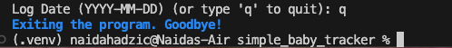
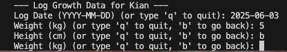

10. **Returned User Login**

Upon starting the application, users are prompted with a Main Menu to identify themselves as a:
- New User – to register a new profile.
- Returning User – to log in and access previously saved data.
- Quit – to exit the application.
Users enter their previously registered username to log in.
A success message confirms a valid login (e.g., Login successful!).
All data logged previously under that username becomes accessible for viewing or updating.
At any login prompt, users can type 'q' to gracefully exit the program.

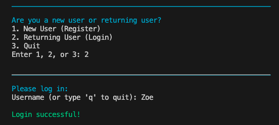

11. **Personalized Welcome Back Message**

After a successful login, returning users are greeted with a friendly, personalized message.
This message confirms that the system has recognized the user and has loaded their baby’s profile and previous data.
It enhances user experience by making the interaction feel warm and tailored.

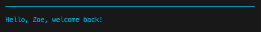

12. **User Profile & Summary View**

Upon login, the user is shown their personalized profile with essential baby information.
Also, a summary sheet is generated and updated with the most recent data entries.

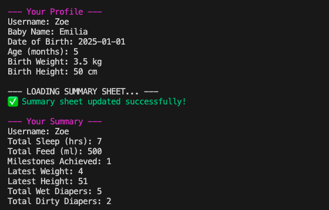

13. **Main Menu Access**

After successful login and summary display, users are directed to the Main Menu.
A simple numeric menu allows users to select what type of data they wish to log.
It gives a clean and intuitive navigation—no need to type additional commands like 'q' to quit here.
Choosing 4 lets users exit the program gracefully.
It ensures a clear transition from viewing data to updating or logging new entries. So, if the user does not want to enter growth data for today's login, they can simply skip to logging milestones instead.

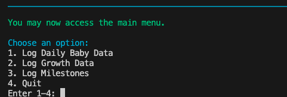

14. **Exit And Goodbye Message**

Users can choose to quit the app anytime from the main menu by selecting option 4. Upon quitting, the app displays a clear and friendly goodbye message. This confirms the session has ended politely and cleanly.

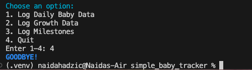

15. **Visual Feedback**

I used colored console text with colorama:
- Green for success messages
- Red for errors or invalid inputs
- Yellow for additional info and introductory texts
- Blue for goodbye message
- Cyan for instructions
- Magenta for My Profile and Latest Summary Update Sheet

15. **Google Sheets**

- user_info worksheet

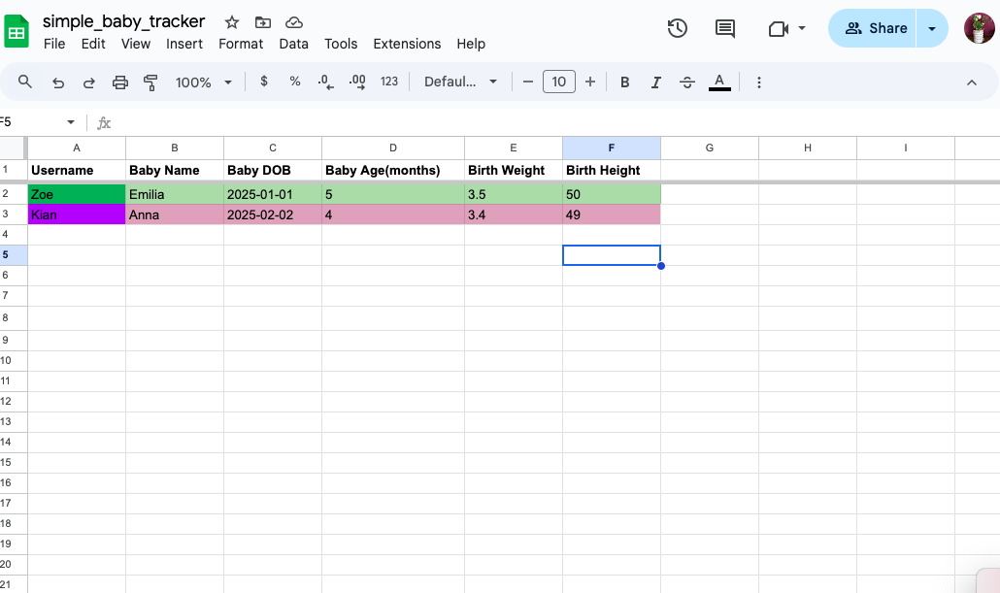

- daily_log worksheet

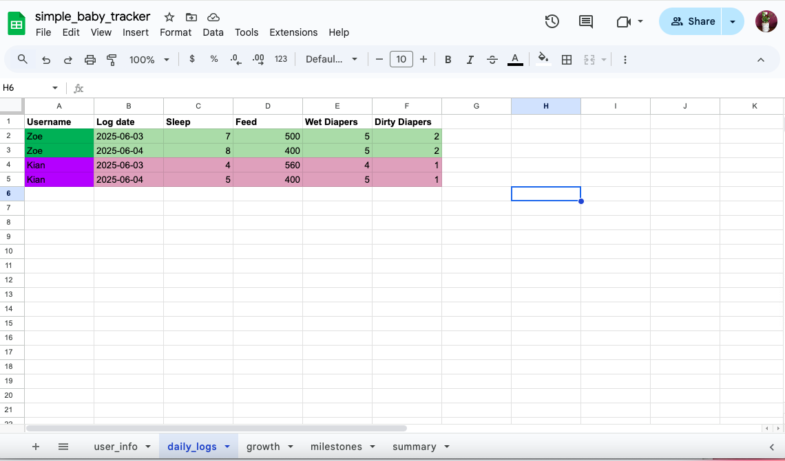

- growth worksheet

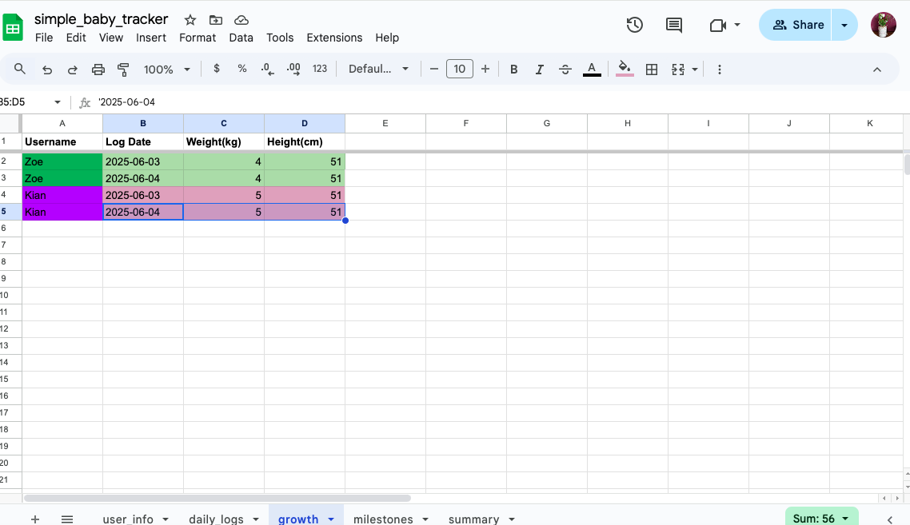

- milestones

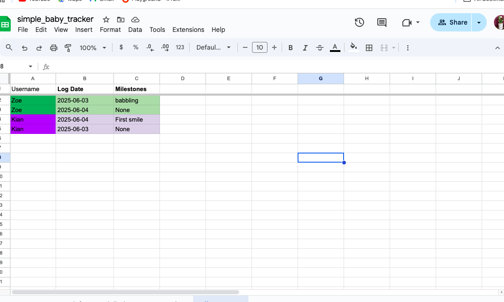

- summary worksheet

## Future Features

- I was wondering whether I should add hints about the amount of food or sleep a child needs each month so that parents would aim for that, but I decided not to include it in future plans because every child is different and each has different needs and doctor recommendations.
- Allow users to create profiles for multiple babies under the same account.
- Auto-save progress every few inputs to prevent data loss if the program closes unexpectedly.
- Record the exact time for each data entry, not just the date.
- Add password and password reset option (Although this option was initially included, but I removed it in agreement with my mentor.)
- Allow users to export their baby’s logged data as CSV or simple text reports.
- Add the function to View Today's Summary for the Logged-in Users.

## Bugs

### Fixed Bugs 

* BUG:'Back'Option - When I typed 'b' to go back during data input (e.g., while entering sleep hours), the app exited the whole function instead of returning to the previous step. The 'b' input wasn’t being intercepted properly and was treated like any invalid input or passed through without a return handler.
**FIX**: I added input checking for 'b' in each step. When detected, the function now returns a 'back' signal, and the main loop handles re-displaying the previous prompt.

* BUG: Daily Logs Date Association - Daily logs stored in the Google Sheet did not contain a clear date, making it difficult to analyze trends or retrieve entries for a specific day.The append_row() function did not include a timestamp by default.
**FIX**: I introduced a timestamp using Python’s datetime module and prepended it to each row before storing.

* BUG: Invalid Input (e.g., Typing 'ten') - Entering non-numeric values for numeric questions (e.g., "ten" instead of 10) I caused a ValueError and crashed the app. int() or float() conversion was not wrapped in error handling logic.
**Fix**: I wrapped all numeric conversions in try/except blocks and looped until the user provided a valid value.

* BUG: "None" Milestone - When I entered None in the milestone input, the app still counted it as a valid milestone entry in the summary, inflating the count.The milestone logging function did not properly validate user input. The input 'None' was being appended to the milestone log and later included in summary statistics.
**FIX**: I added input validation to check for 'None' before saving a milestone.

* BUG: Duplicate log_date Prevention - In the log_milestones(), log_growth(), log_daily_baby_data() functions, a bug was fixed that previously allowed users to log multiple milestones and other information for the same date under the same username. This could lead to confusion and data inconsistencies.
**FIX**:  Now, before saving a milestone, the function checks if a milestone for the given username and date already exists. If a duplicate is found, the user is informed with a clear error message and prompted to enter a different date. This prevents accidental overwriting or multiple entries for the same milestone, growth or daily data dates, ensuring cleaner and more accurate logs.

### Unfixed Bugs

As of the latest testing, no bugs have been identified. The website is functioning as expected, to the best of my knowledge.

## Testing

### Manual Testing

Manual tests were carried out throughout the development process. Each feature was tested to ensure correct functionality, including error handling, user input validation, and support for multiple user accounts. This included:
- Username and Name Validation: Inputs were tested to confirm that whitespace and special characters were not allowed. The username was validated to accept only 2–10 characters.
- Password Validation: Password inputs were tested to ensure they were at least 6 characters long and contained no whitespace.
- New and Returning Users: Multiple scenarios were tested, including new user registration, returning user login, invalid entries, and quitting mid-process.

### Validation Testing

I used the **CI Python Linter** and followed the **PEP8 guidelines** to validate my code.

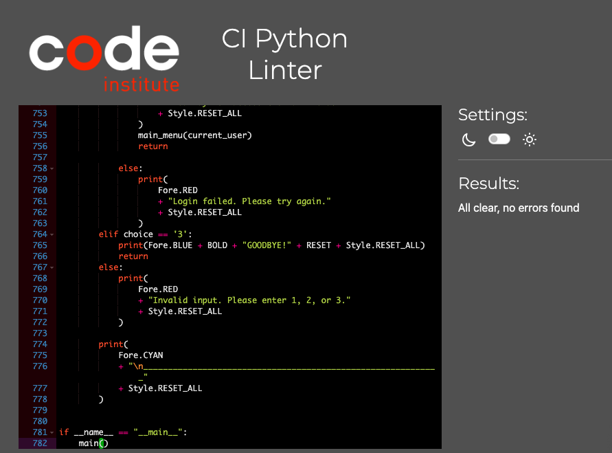

## Deployment

This project was deployed using the Code Institute’s mock terminal for Heroku.

Steps for deployment:
1. Add the list of requirements by writing in the terminal "pip3 freeze > requirements.txt".
2. Log into Heroku.
4. Click "NEW" in the top right-hand corner and choose the option Create new app.
5. Input a unique app name.
6. Choose Region - Europe.
7. Choose "Settings" from the menu.
8. Go to section "Config Vars" and click button "Reveal Config Vars”.
9. Add key and value. For this project I added creds.json as the key and copied the contents of this into the value.
10. Go to section "Build packs" and click "Add build pack”.
11. Go to "Deploy" in the menu bar.
12. Go to section "deployment method", choose "GitHub".
13. New section will appear "Connect to GitHub".
14. Type the name of your repository and click "search".
15. Once Heroku finds your repository - click "connect".
16. Click "Enable automatic deploys" or manually deploy by choosing "Deploy branch".
17. Click "Deploy branch".

## Forking and Cloning
To fork this repository:

1. Log in to your Github account.
2. Navigate to the repository page.
3. Click the "Fork" button in the top-right corner.

To Clone:

1. Go to the forked repository on Github.
2. Click the green "Code" button.
3. Copy the HTTPS link: 
4. Open your terminal and type: git clone 

## Create a Virtual Environment (using VS code)

Open the Command Palette (Ctrl + Shift + P on Windows or Cmd + Shift + P on macOS).
In the Command Palette type: Python: Create Environment.
Select Python: Create Environment from the list.
Select Venv from the drop down menu.
Check that your environment is active by editing an .py file and looking for ('venv': venv) near the bottom right hand corner of the screen.

## Technology Used

* Visual Studio Code
* GitHub
* Git used for version control. (git add, git commit, git push)
* CI Python Linter validating the Python code.
* Heroku for deploying the website.
* Flow charts from Lucid Chart app

## Python Version, Packages and Libaries Used
The project was developed using Python 3.13.2.

I've used the following Python packages and/or external imported packages:
* datetime - Used to work with date and time, particulary to calculate recovery timelines based on number of days since surgery.
* gspread - Used to interact with Google Sheets API for reading and writing data to a spreadsheet.
* google.oauth2.service_account.Credentials - Provides secure authentication for access to Google Sheets API.
* colorama - Used to add colour to the terminal output.
* sys - used to see paths to files and exit code if necessary

## Credits

- https://www.canva.com/dream-lab 
- https://emojipedia.org/ 

## Acknowledgements

- I'm really grateful to my mentor, Dick Vlaanderen, for sharing helpful advice and thoughtful suggestions throughout the project.

- I’d like to thank my husband for his unwavering support, especially for patiently taking care of our nine- month-old baby while I was working on my project.

